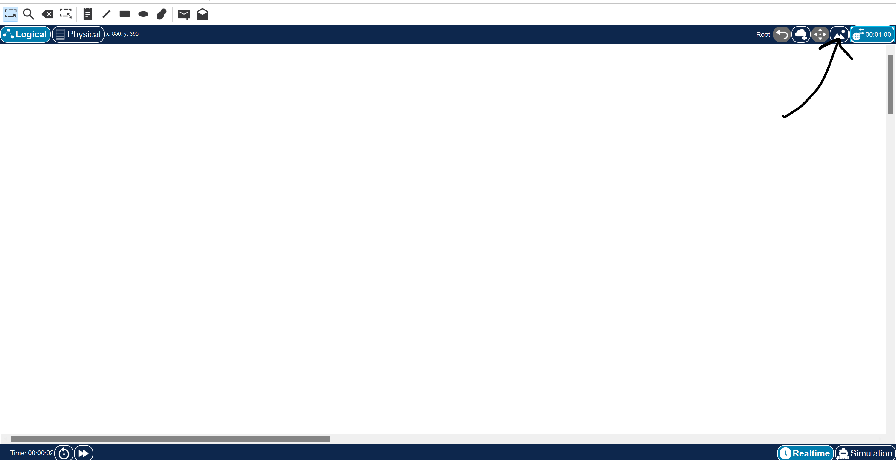
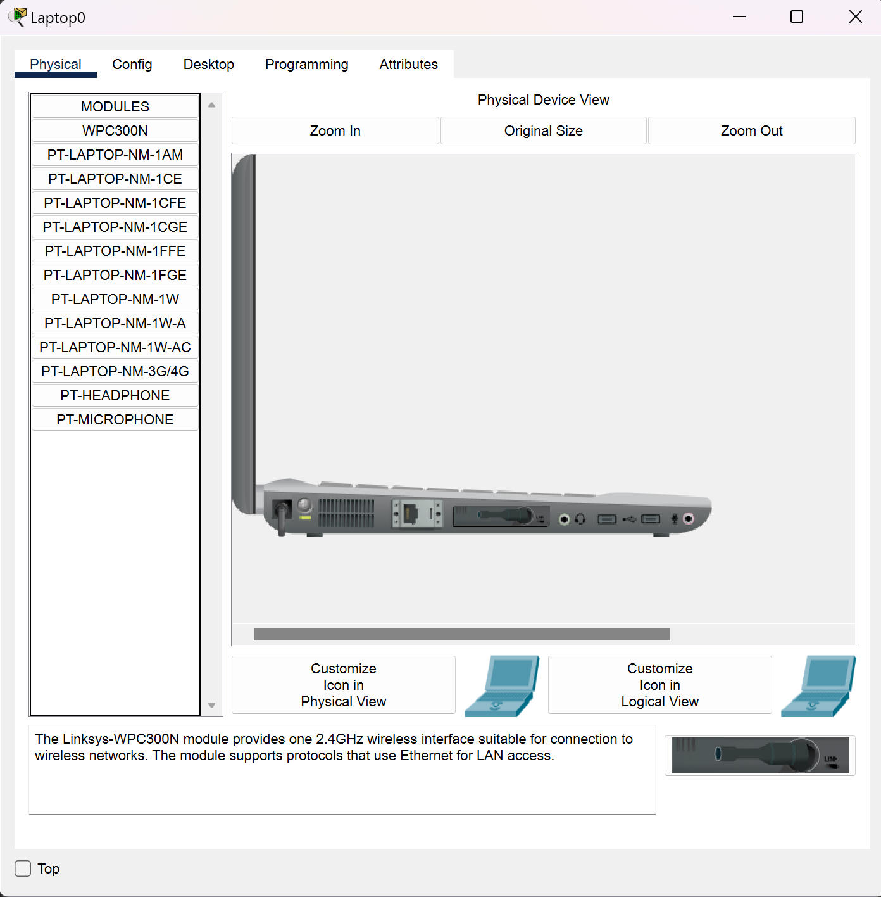

# Cisco Packet Tracer Learning Scenario 2

## File Types
There are four filetypes that we will see used with the Cisco Packet Tracer, each is used for different reasons - the information contained and whatnot. 

### PKA
This is a file that we will see in activities that are scored. It contains a set of instructions and will consist of an initial and completed network (so we can see the solution). The answer network may run in the background for scoring purposes. (This is a part of the guided tutor one)

### PKT 
This is a file that is created when we save a network that was created in the program. They can contain background images that are embedded as the background to a network, but contain no instruction windows or scoring. 

### PKSZ
These are the files used in the Packet Tracer Tutored Activities. They bundle a PKA file, the media (AV assests) and a scripting file to provide the hints. This is what we may occasionally encounter when working on this 

### PKZ
Deprecated

## Assessments

### Packet Tracer Media Objects 
These are either a PKA or PKT file, this can show up inline with questions on quizzes or tests in a module. The file is launched from within the quiz/test - in these we will configure a network or look at the topology and then answer questions based on the actions we took, and the makeup of the topology.
### Packet Tracer Skill Assessments
These are encountered midway through or at the end of a course, we implement the technologies that we have covered within the course. They are standalone assessments and will be graded using their own standalone grading engine. We will receive item by item feedback on the results of our work.   

## Build a Home Network

### Determine end device IP
Device -> Config -> Eth0 (Or some other) 
We can get the IP (if static) and under global settings we can find the gateway IP.

If we are using a DHCP addressing we can see them, but they are greyed out as they are received by the DHCP server. 

We can also determine this through the command prompt - the machines emulated are Windows based. So we can use **ipconfig** to print the information.

### Device Connection Types
The lights on the link will be green if a connection is established and red otherwise. 

* Automatic: Best cable between two devices
* Console: RS232 on PC, or some other port, allows us to manage the switch or router using a terminal emulator of some kind.
* Straight Through: Often attached to ethernet to connect a PC switch or router.  
* Crossover: Two of the same devices will often use a crossover cable, this may vary based on the connection type and port.
* Wireless: Managed by the device themselves, we can customize them quite a bit, and add certain security configurations.

### Create a simple network 

We are creating a network consisting of the internet could (Some object we use to "simulate the internet") A modem to connect to the internet, a wireless home router, a laptop and PC. 

#### Connections
Refer to the activity <a href="Activities/2.1.1_PT_Simple_Home_Solved.pka">In The Associated Folder</a>
**Modem**: is connected to the internet using a coax cable
**Wireless Router**: is connected to the modem's Eth1 with a copper straight through cable.
**PC**: Connected to wireless router Eth1 with copper straight through.
**Laptop**: Connected to the wireless router using a wireless NIC. May not happen automatically - need to go into the Desktop and use Wireless Connect. 

### Networking Principles 
DHCP - 
Static IPs
Default Gateway 

## Advanced Features 
We can apply background images to the cisco packet tracer using the button in the image below. This leads to the natural though of how many images of Chris do I have.

</img>

We can also customize device icons, once you have clicked on the device and the options appear we can chose to change the image in the logical or physical view, as seen below.

</img>

We may want to use this more often when we add a IoT "Thing" and add an image to differentiate it from other things.